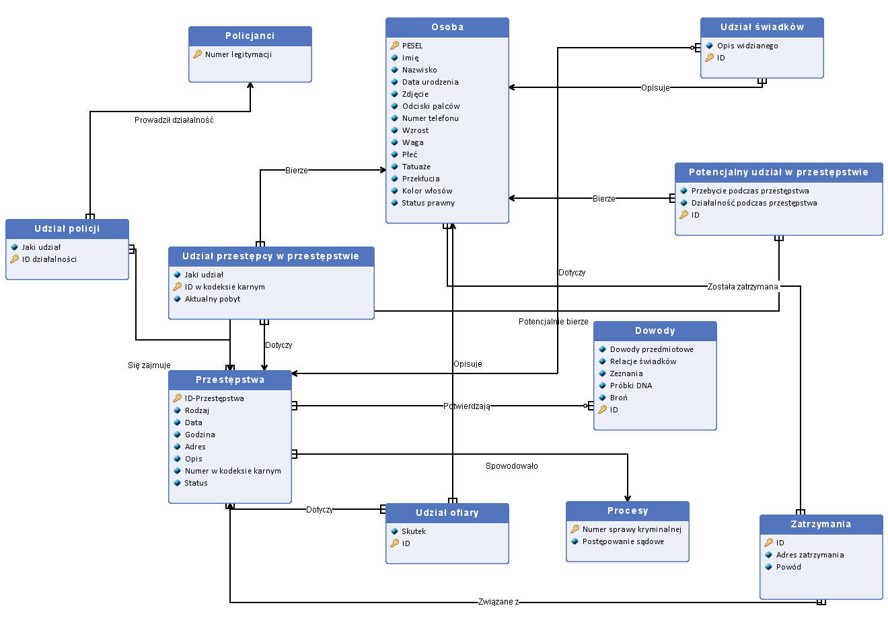

# Project Title: Database for police department

## Overview

This project is a project from the "Databases" course, designed to learn basic functions of database management system, on design of relational 
databases and querying them in SQL, on transactional processing, data security nad
related problems

## Database Description

The police keep records of crimes. Includes: crimes, offenders, (if detected), police officers.

## Information, found in the database:
### The database is to contain information about crimes,criminals,police officers and data about them, which are needed for the daily maintenance of the database.
The customer requires that the database contains such data:
1. Information about the crime
- Type of crime (e.g. theft, robbery, murder, etc.)
- Date and time of the crime (if known)
- Place of the crime (address)
-Description of the crime
2. Information about suspects
- Personal information of the suspects (name,surname,date of birth,photo,PESEL,fingerprints)
- Description of appearance(height,weight,eye color,tattoos,piercings,hair color(if any))
- Contact information( address,phone number,email address)
3. Information about the victims
- Personal information( name,surname,date of birth,photo,PESEL,fingerprints)
- Contact information( address, phone number, email address)
4. Evidence and material evidence
- Protected evidence (e.g., objects, DNA samples, weapons, etc.).
- Witness accounts and testimonies
- Video or audio recordings of links to the crime
5. Information about detainees and arrests
- Date and location of suspect's arrest
- Reason for arrest
- Information about the legal status of the suspect
6. Information about police officers, conducted arrest
- Personal information (name,surname,date of birth,photo,PESEL,title)
7. Procedural information 
- Criminal case number 
- Names and contact information of officers in charge of the investigation
- Information about court proceedings, including court dates and sentences
8. Information on previous crimes and criminal record of suspects.
9. Information on the relationship between different crimes and suspects (crime pattern analysis).
10. Crime statistics that can help analyze trends and allocate police resources.
11. Information on searches for people who are suspected of committing crimes or violating the law.
12. Information on confiscated property or assets related to the crime.
  
## Database Schema

## FIles
### CREATE.sql - a file that creates all the tables for the database
### INSERT.sql - a file that fills the created tables with information
### CASCAD.sql - a file showing that the created database supports cascading deletions and updates
### DROP.sql - a file that deletes all tables and the data they contained
### SELECT.sql - a file that contains example queries for the database and the solutions for these queries

## Contributing

Feel free to contribute to the project by submitting [issues](https://github.com/imwrdo/database-police/issues) or [pull requests](https://github.com/iwmrdo/database-police/pulls). Your input is highly appreciated.

## License

This project is licensed under the [MIT License](LICENSE) - see the [LICENSE](LICENSE) file for details.

---

